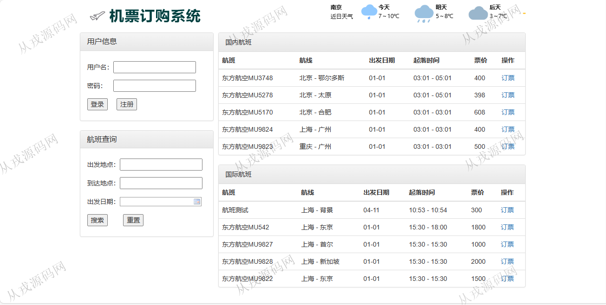
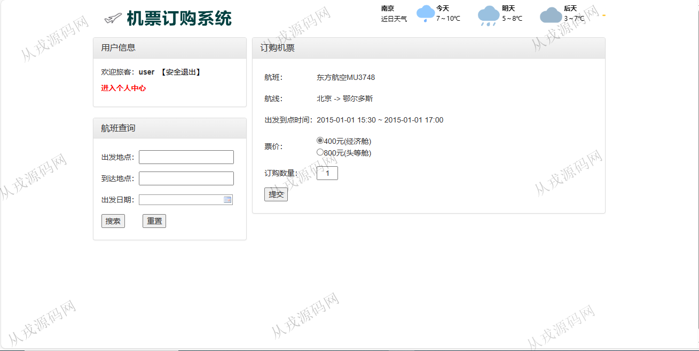
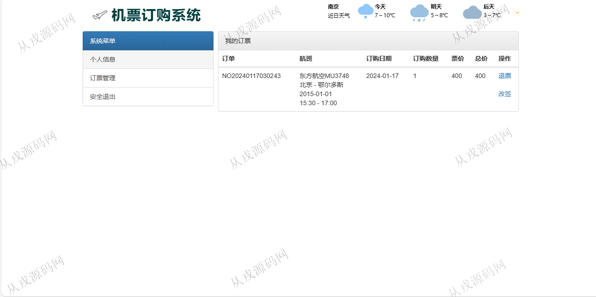
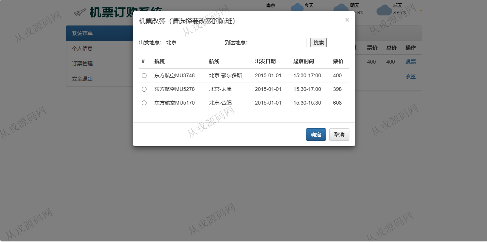
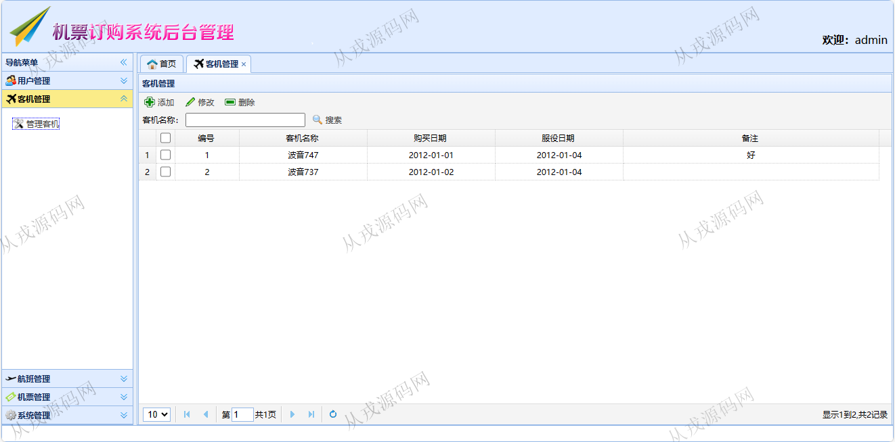
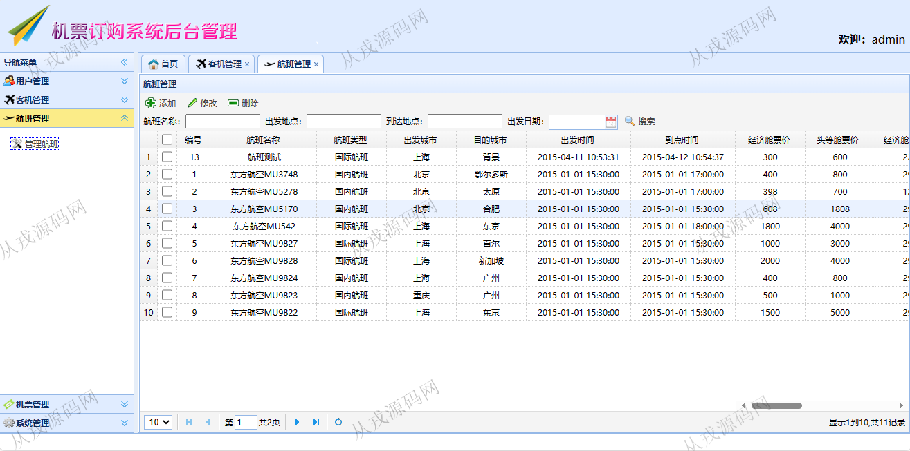
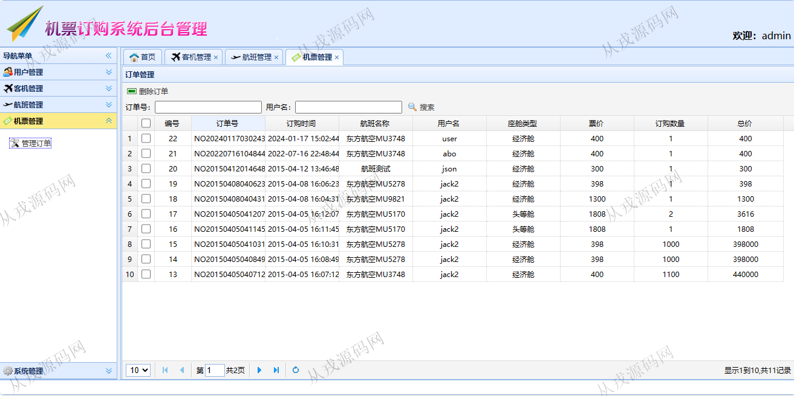
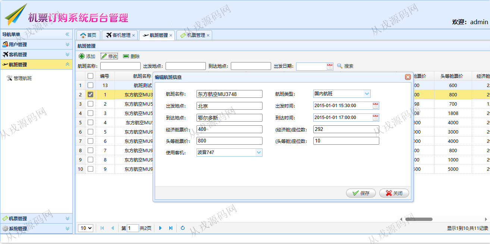

<h1 align="center">167.机票订购管理系统</h1>

 获取sql文件 QQ: 386869957 QQ群: 377586148 

 [更多源码项目: 从戎源码网](https://armycodes.com/) 

## 简介

> 本代码来源于网络,仅供学习参考使用!
>
> 提供1.远程部署/2.修改代码/3.设计文档指导/4.框架代码讲解等服务
> 
> 用户端访问地址：http://localhost:8080/flight_indexList.action
> 
> 用户：user 123456
> 
> http://localhost:8080/admin/login.jsp
>
> 管理员 : admin 123456
>

## 项目介绍
基于ssh的机票订购管理系统：前端 jsp、jquery，后端 struts、spring、hibernate；角色分为管理员、用户；集成机票查询，在线购票，在线改签等功能于一体的系统。

## 功能介绍

### 用户

- 基本功能：登录、注册、退出、个人信息查看与修改、密码修改
- 航班展示：国内航班列表，国际航班列表
- 在线订票：查询航班信息，购票
- 订票管理：已购买票信息列表查询，退票，改签

### 管理员

- 用户管理：用户信息的增删改查，用户信息也可以由用户在用户端页面自行注册
- 客机管理：客机信息的增删改查，按客机名称搜索
- 航班管理：航班信息的增删改查，多条件查询
- 机票管理：用户订票后，管理员可以查询用户的订单信息，按订单号和用户名查询，也可以删除订单

## 环境

- <b>IntelliJ IDEA 2021.3</b>

- <b>Mysql 5.7.26</b>

- <b>Tomcat 7.0.73</b>

- <b>JDK 1.8</b>

## 运行截图

